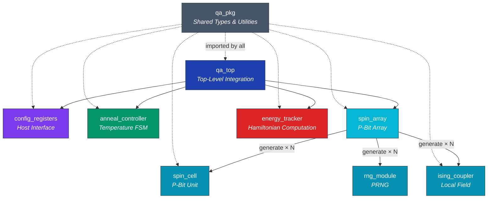
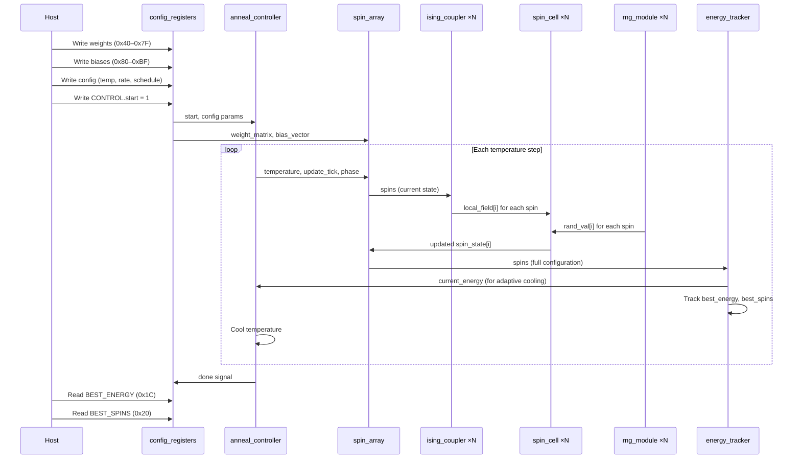

# Architecture Document

> Module hierarchy, signal flow, memory map, scaling analysis, and FPGA resource estimates for the Quantum-Inspired Optimization Accelerator.

---

## Table of Contents

1. [Module Hierarchy](#1-module-hierarchy)
2. [Top-Level Block Diagram](#2-top-level-block-diagram)
3. [Data Flow](#3-data-flow)
4. [Module Specifications](#4-module-specifications)
5. [Memory Map](#5-memory-map)
6. [Scaling Analysis](#6-scaling-analysis)
7. [Timing Considerations](#7-timing-considerations)
8. [Clock Domain Strategy](#8-clock-domain-strategy)
9. [FPGA Resource Estimates](#9-fpga-resource-estimates)

---

## 1. Module Hierarchy



### Instance Count

| Module | Instances | Parameterization |
|---|---|---|
| `qa_top` | 1 | Top-level |
| `config_registers` | 1 | `NUM_SPINS`, `DATA_WIDTH`, `ADDR_WIDTH` |
| `anneal_controller` | 1 | `DATA_WIDTH`, `INITIAL_TEMP`, `COOLING_RATE`, `STEPS_PER_TEMP`, `SCHEDULE_TYPE` |
| `spin_array` | 1 | `NUM_SPINS`, `DATA_WIDTH`, `UPDATE_STRATEGY` |
| `spin_cell` | N | `DATA_WIDTH` |
| `ising_coupler` | N | `NUM_SPINS`, `DATA_WIDTH`, `PIPELINED` |
| `rng_module` | N | `WIDTH`, `SEED` (unique per instance: `0xACE1 + i * 0x1337`) |
| `energy_tracker` | 1 | `NUM_SPINS`, `DATA_WIDTH`, `CONVERGE_THRESHOLD` |

---

## 2. Top-Level Block Diagram

```
                              ┌──────────────────────────────────────────────┐
                              │                  qa_top                      │
                              │                                              │
    host_wr_en ──────────────►│  ┌──────────────────┐                        │
    host_rd_en ──────────────►│  │ config_registers  │                        │
    host_addr[11:0] ─────────►│  │                  │──── weights ──────┐    │
    host_wr_data[31:0] ──────►│  │  Register Bank   │──── biases ───────┤    │
                              │  │  (0x00 – 0xBF)   │──── schedule ──┐  │    │
    host_rd_data[31:0] ◄──────│  │                  │──── start ──┐  │  │    │
    host_rd_valid ◄───────────│  └──────────────────┘             │  │  │    │
                              │                                    │  │  │    │
                              │  ┌──────────────────┐             │  │  │    │
                              │  │ anneal_controller │◄── start ──┘  │  │    │
                              │  │                  │◄── schedule ───┘  │    │
                              │  │  Temperature FSM  │◄── energy ────┐  │    │
                              │  │                  │                │  │    │
                              │  │                  │── temp ────┐   │  │    │
                              │  │                  │── tick ────┤   │  │    │
                              │  │                  │── phase ───┤   │  │    │
    busy ◄────────────────────│  │                  │── busy     │   │  │    │
    done ◄────────────────────│  │                  │── done     │   │  │    │
    current_temp ◄────────────│  └──────────────────┘            │   │  │    │
                              │                                   │   │  │    │
                              │  ┌──────────────────┐            │   │  │    │
                              │  │   spin_array      │◄── temp ──┘   │  │    │
                              │  │                  │◄── tick        │  │    │
                              │  │  ┌────┐ ┌─────┐  │◄── phase      │  │    │
                              │  │  │ SC │ │ IC  │  │◄── weights ───┘  │    │
                              │  │  │ ×N │ │ ×N  │  │◄── biases ──────┘    │
                              │  │  ├────┤ ├─────┤  │                       │
                              │  │  │RNG │ │     │  │── spins ────┐        │
    final_spins ◄─────────────│  │  │ ×N │ │     │  │             │        │
                              │  │  └────┘ └─────┘  │             │        │
                              │  └──────────────────┘             │        │
                              │                                    │        │
                              │  ┌──────────────────┐             │        │
                              │  │  energy_tracker   │◄── spins ──┘        │
                              │  │                  │◄── weights           │
                              │  │  Hamiltonian &    │◄── biases            │
                              │  │  Best Tracker     │                       │
                              │  │                  │── energy ────────────┘
    best_energy ◄─────────────│  │                  │── converged
    converged ◄───────────────│  └──────────────────┘
                              │                                              │
                              └──────────────────────────────────────────────┘
```

---

## 3. Data Flow

The system processes an optimization problem through the following pipeline:



### Data Flow Summary

| Signal Path | Data | Width | Direction |
|---|---|---|---|
| Host → `config_registers` | Weights, biases, config | 32-bit writes | Input |
| `config_registers` → `spin_array` | Weight matrix (packed) | `NUM_SPINS² × DATA_WIDTH` | Config |
| `config_registers` → `spin_array` | Bias vector | `NUM_SPINS × DATA_WIDTH` | Config |
| `config_registers` → `anneal_controller` | Schedule params | Various | Config |
| `anneal_controller` → `spin_array` | Temperature | `DATA_WIDTH` | Control |
| `anneal_controller` → `spin_array` | Update tick, phase | 1-bit each | Control |
| `spin_array` → `energy_tracker` | Spin states | `NUM_SPINS` | Data |
| `energy_tracker` → `anneal_controller` | Current energy | `2 × DATA_WIDTH` (signed) | Feedback |

---

## 4. Module Specifications

### 4.1 `qa_pkg` — Shared Package

**Purpose:** Defines types, constants, register addresses, and utility functions shared across all modules.

**Key Definitions:**

| Item | Type | Value |
|---|---|---|
| `DEFAULT_DATA_WIDTH` | Parameter | 16 |
| `DEFAULT_NUM_SPINS` | Parameter | 8 |
| `schedule_type_t` | Enum | `SCHEDULE_LINEAR`, `SCHEDULE_EXPONENTIAL`, `SCHEDULE_ADAPTIVE` |
| `update_strategy_t` | Enum | `UPDATE_SEQUENTIAL`, `UPDATE_CHECKERBOARD`, `UPDATE_PARALLEL` |
| `rng_mode_t` | Enum | `RNG_LFSR`, `RNG_XORSHIFT` |
| `accel_state_t` | Enum | `STATE_IDLE` → `STATE_CONFIGURE` → `STATE_ANNEALING` → `STATE_COOLDOWN` → `STATE_FINISHED` |
| `fp_multiply()` | Function | Q0.16 fixed-point multiplication (returns upper 16 of 32-bit product) |

---

### 4.2 `qa_top` — Top-Level Integration

**Purpose:** Instantiates and interconnects all sub-modules. Provides the host-facing interface.

**Parameters:**

| Parameter | Default | Description |
|---|---|---|
| `NUM_SPINS` | 8 | Number of spin variables |
| `DATA_WIDTH` | 16 | Fixed-point bit width |
| `UPDATE_STRATEGY` | 2 (parallel) | Spin update mode |
| `SCHEDULE_TYPE` | 0 (linear) | Cooling schedule |
| `INITIAL_TEMP` | `0x7FFF` | Starting temperature |
| `COOLING_RATE` | `0x0100` | Cooling rate parameter |
| `STEPS_PER_TEMP` | 256 | Spin sweeps per temperature level |

**Port Interface:**

| Port | Direction | Width | Description |
|---|---|---|---|
| `clk` | Input | 1 | System clock |
| `rst_n` | Input | 1 | Active-low async reset |
| `host_wr_en` | Input | 1 | Host write enable |
| `host_rd_en` | Input | 1 | Host read enable |
| `host_addr` | Input | 12 | Host address bus |
| `host_wr_data` | Input | 32 | Host write data |
| `host_rd_data` | Output | 32 | Host read data |
| `host_rd_valid` | Output | 1 | Read data valid |
| `final_spins` | Output | `NUM_SPINS` | Final spin configuration |
| `done` | Output | 1 | Annealing complete |
| `busy` | Output | 1 | Annealing in progress |
| `converged` | Output | 1 | Energy has converged |
| `current_temp` | Output | `DATA_WIDTH` | Current temperature |
| `best_energy` | Output | `2×DATA_WIDTH` | Best energy found (signed) |

---

### 4.3 `config_registers` — Host Interface Register Bank

**Purpose:** Memory-mapped register file for host CPU communication. Supports write access for configuration and weight/bias loading, and read access for status and results.

**Parameters:**

| Parameter | Default | Description |
|---|---|---|
| `NUM_SPINS` | 8 | Determines weight/bias address space |
| `DATA_WIDTH` | 16 | Register data width |
| `ADDR_WIDTH` | 12 | Address bus width (4K address space) |

**Port Interface:**

| Port | Direction | Width | Description |
|---|---|---|---|
| `clk` | Input | 1 | System clock |
| `rst_n` | Input | 1 | Active-low async reset |
| `wr_en` | Input | 1 | Write enable |
| `rd_en` | Input | 1 | Read enable |
| `addr` | Input | `ADDR_WIDTH` | Register address |
| `wr_data` | Input | 32 | Write data |
| `rd_data` | Output | 32 | Read data |
| `rd_valid` | Output | 1 | Read data valid (1-cycle latency) |
| `start` | Output | 1 | Start pulse (auto-clearing) |
| `clear` | Output | 1 | Clear pulse (auto-clearing) |
| `init_temp` | Output | `DATA_WIDTH` | Initial temperature |
| `cool_rate` | Output | `DATA_WIDTH` | Cooling rate |
| `schedule_type` | Output | 2 | Cooling schedule selector |
| `steps_per_temp` | Output | 32 | Steps per temperature level |
| `config_valid` | Output | 1 | Configuration write strobe |
| `weight_matrix_packed` | Output | `NUM_SPINS²×DATA_WIDTH` | Packed weight matrix |
| `bias_vector` | Output | Array `NUM_SPINS×DATA_WIDTH` | Bias vector |

**Design Decisions:**
- Auto-clearing control bits: `start` and `clear` in the CONTROL register (0x00) are set by the host and automatically clear on the next cycle, producing single-cycle pulses.
- Invalid address reads return `0xDEAD_BEEF` for debug visibility.
- Write-only weight/bias registers save read-back logic area.

---

### 4.4 `anneal_controller` — Temperature Schedule FSM

**Purpose:** Manages the annealing temperature schedule and generates update timing signals for the spin array.

**Parameters:**

| Parameter | Default | Description |
|---|---|---|
| `DATA_WIDTH` | 16 | Temperature bit width |
| `INITIAL_TEMP` | `0x7FFF` | Starting temperature |
| `COOLING_RATE` | `0x0100` | Cooling rate |
| `STEPS_PER_TEMP` | 256 | Sweeps per temperature level |
| `SCHEDULE_TYPE` | 0 | Default cooling schedule |

**Port Interface:**

| Port | Direction | Width | Description |
|---|---|---|---|
| `clk` | Input | 1 | System clock |
| `rst_n` | Input | 1 | Active-low async reset |
| `start` | Input | 1 | Begin annealing |
| `current_energy` | Input | `2×DATA_WIDTH` (signed) | Feedback for adaptive cooling |
| `config_valid` | Input | 1 | Runtime config strobe |
| `config_init_temp` | Input | `DATA_WIDTH` | Runtime initial temp |
| `config_cool_rate` | Input | `DATA_WIDTH` | Runtime cooling rate |
| `config_schedule` | Input | 2 | Runtime schedule select |
| `busy` | Output | 1 | Annealing in progress |
| `done` | Output | 1 | Annealing complete |
| `temperature` | Output | `DATA_WIDTH` | Current temperature |
| `update_tick` | Output | 1 | Spin update strobe |
| `checkerboard_phase` | Output | 1 | Even/odd phase for checkerboard mode |

**FSM States:** `IDLE` → `CONFIGURE` (1 cycle) → `ANNEALING` (main loop) → `FINISHED`

**Adaptive Cooling Detail:** A stagnation counter tracks how many consecutive temperature steps pass without energy improvement. When the counter reaches 10, the cooling rate is doubled to escape plateaus.

---

### 4.5 `spin_array` — Scalable P-Bit Array

**Purpose:** Generates `NUM_SPINS` instances of `rng_module` + `ising_coupler` + `spin_cell` and manages update sequencing.

**Parameters:**

| Parameter | Default | Description |
|---|---|---|
| `NUM_SPINS` | 8 | Array size |
| `DATA_WIDTH` | 16 | Arithmetic precision |
| `UPDATE_STRATEGY` | 2 | Update mode (0=sequential, 1=checkerboard, 2=parallel) |

**Port Interface:**

| Port | Direction | Width | Description |
|---|---|---|---|
| `clk` | Input | 1 | System clock |
| `rst_n` | Input | 1 | Active-low async reset |
| `update_tick` | Input | 1 | Update strobe from controller |
| `checkerboard_phase` | Input | 1 | Phase select for checkerboard mode |
| `temperature` | Input | `DATA_WIDTH` | Current temperature |
| `weight_matrix_packed` | Input | `NUM_SPINS²×DATA_WIDTH` | Flattened weight matrix |
| `bias_vector` | Input | Array `NUM_SPINS×DATA_WIDTH` | Bias vector |
| `spins` | Output | `NUM_SPINS` | Current spin states |
| `energy_deltas` | Output | Array `NUM_SPINS×DATA_WIDTH` (signed) | Per-spin energy deltas |

**Design Details:**
- **RNG seeding:** Each instance gets a unique seed `0xACE1 + i * 0x1337` for decorrelated random sequences.
- **Auto-pipelining:** When `NUM_SPINS > 16`, the `PIPELINED` parameter on `ising_coupler` instances is automatically set to `1` to meet timing.
- **Update gating:** In sequential mode, only one `spin_cell` receives `update_en` per cycle. In checkerboard mode, even-indexed or odd-indexed cells are enabled based on `checkerboard_phase`. In parallel mode, all cells update simultaneously.

---

### 4.6 `spin_cell` — Probabilistic Spin Unit (P-Bit)

**Purpose:** Implements a single p-bit: decides whether to flip based on the local field, temperature, and a random value.

**Parameters:**

| Parameter | Default | Description |
|---|---|---|
| `DATA_WIDTH` | 16 | Bit width (must be ≥ 8) |

**Port Interface:**

| Port | Direction | Width | Description |
|---|---|---|---|
| `clk` | Input | 1 | System clock |
| `rst_n` | Input | 1 | Active-low async reset |
| `update_en` | Input | 1 | Update enable |
| `local_field` | Input | `DATA_WIDTH` (signed) | Effective field from coupler |
| `rand_val` | Input | `DATA_WIDTH` | Random value from RNG |
| `temperature` | Input | `DATA_WIDTH` | Current temperature |
| `spin_state` | Output | 1 | Current spin value |
| `energy_delta` | Output | `DATA_WIDTH` (signed) | Energy change from last update |

**Hardware Sigmoid Approximation:**

```
noise_term = rand_val scaled by temperature
threshold  = local_field + noise_term
new_spin   = (threshold > 0) ? 1 : 0
```

This replaces the computationally expensive $\tanh(h/T)$ with a linear approximation that preserves the essential behavior: strong fields produce deterministic spins, weak fields produce stochastic spins, and temperature controls the transition width.

---

### 4.7 `ising_coupler` — Local Field Computation

**Purpose:** Computes the effective local field for a spin: $h_{\text{eff},i} = \sum_j J_{ij}\sigma_j + h_i$.

**Parameters:**

| Parameter | Default | Description |
|---|---|---|
| `NUM_SPINS` | 8 | Total number of spins in the system |
| `DATA_WIDTH` | 16 | Weight/field bit width |
| `PIPELINED` | 0 | Insert pipeline register (0=combinational, 1=pipelined) |

**Port Interface:**

| Port | Direction | Width | Description |
|---|---|---|---|
| `clk` | Input | 1 | System clock (used only when `PIPELINED=1`) |
| `rst_n` | Input | 1 | Active-low async reset |
| `spins` | Input | `NUM_SPINS` | All spin states |
| `weights_packed` | Input | `NUM_SPINS×DATA_WIDTH` (signed) | Row of weight matrix for this spin |
| `bias` | Input | `DATA_WIDTH` (signed) | Local bias |
| `local_field` | Output | `DATA_WIDTH` (signed) | Computed effective field |
| `field_valid` | Output | 1 | Field output valid (1 when `PIPELINED=0`, delayed when `PIPELINED=1`) |

**Accumulation:**

```systemverilog
for (int j = 0; j < NUM_SPINS; j++) begin
    if (spins[j])
        acc += weights[j];   // σ_j = +1
    else
        acc -= weights[j];   // σ_j = -1
end
local_field = acc + bias;
```

Guard bits: accumulator width is `DATA_WIDTH + $clog2(NUM_SPINS) + 1` to prevent overflow.

---

### 4.8 `rng_module` — Pseudo-Random Number Generator

**Purpose:** Generates pseudo-random numbers for stochastic spin updates. Two modes: Galois LFSR and xorshift.

**Parameters:**

| Parameter | Default | Description |
|---|---|---|
| `WIDTH` | 16 | Output width |
| `SEED` | `0xACE1` | Initial state |
| `XORSHIFT_MODE` | 0 | 0 = Galois LFSR, 1 = xorshift |

**Port Interface:**

| Port | Direction | Width | Description |
|---|---|---|---|
| `clk` | Input | 1 | System clock |
| `rst_n` | Input | 1 | Active-low async reset |
| `en` | Input | 1 | Generate enable |
| `seed_load` | Input | 1 | Load new seed |
| `seed_val` | Input | `WIDTH` | Seed value (zero-protected) |
| `rand_out` | Output | `WIDTH` | Random output |

**LFSR Polynomial:** $x^{16} + x^{14} + x^{13} + x^{11} + 1$ → feedback taps at bits 16, 14, 13, 11.

**Xorshift Operations:** `state ^= state << 7; state ^= state >> 9; state ^= state << 8;`

---

### 4.9 `energy_tracker` — Hamiltonian & Best-Solution Tracker

**Purpose:** Computes the full Ising Hamiltonian energy for the current spin configuration and tracks the best (lowest energy) solution found during annealing.

**Parameters:**

| Parameter | Default | Description |
|---|---|---|
| `NUM_SPINS` | 8 | Number of spins |
| `DATA_WIDTH` | 16 | Weight/spin data width |
| `CONVERGE_THRESHOLD` | 64 | Stable cycles for convergence |

**Port Interface:**

| Port | Direction | Width | Description |
|---|---|---|---|
| `clk` | Input | 1 | System clock |
| `rst_n` | Input | 1 | Active-low async reset |
| `enable` | Input | 1 | Computation enable |
| `clear` | Input | 1 | Reset best tracking |
| `spins` | Input | `NUM_SPINS` | Current spin states |
| `weight_matrix_packed` | Input | `NUM_SPINS²×DATA_WIDTH` | Full weight matrix |
| `bias_vector` | Input | Array `NUM_SPINS×DATA_WIDTH` | Bias vector |
| `current_energy` | Output | `2×DATA_WIDTH` (signed) | Current Hamiltonian energy |
| `best_energy` | Output | `2×DATA_WIDTH` (signed) | Best energy found |
| `best_spins` | Output | `NUM_SPINS` | Spin config at best energy |
| `converged` | Output | 1 | Energy stable for threshold cycles |

**Hamiltonian Computation:**

```systemverilog
// E = -Σ_{i<j} J_ij σ_i σ_j - Σ_i h_i σ_i
for (i = 0; i < NUM_SPINS; i++) begin
    for (j = i+1; j < NUM_SPINS; j++) begin
        if (spins[i] == spins[j])
            energy -= weight[i][j];  // aligned: -J (ferromagnetic lowers energy)
        else
            energy += weight[i][j];  // anti-aligned: +J
    end
    if (spins[i])
        energy -= bias[i];
    else
        energy += bias[i];
end
```

**Convergence Detection:** A counter increments each cycle where `current_energy == best_energy`. When the counter reaches `CONVERGE_THRESHOLD`, the `converged` output is asserted.

---

## 5. Memory Map

The `config_registers` module exposes the following memory-mapped register interface:

| Address | Name | R/W | Default | Description |
|---|---|---|---|---|
| `0x00` | `CONTROL` | W | `0x0000_0000` | Bit 0: `start` (auto-clear), Bit 1: `clear` (auto-clear) |
| `0x04` | `STATUS` | R | — | Bit 0: `busy`, Bit 1: `done`, Bit 2: `converged` |
| `0x08` | `NUM_SPINS` | R | Param | Number of spins (read-only, set at elaboration) |
| `0x0C` | `INIT_TEMP` | RW | `0x7FFF` | Initial annealing temperature |
| `0x10` | `COOL_RATE` | RW | `0x0100` | Cooling rate parameter |
| `0x14` | `SCHEDULE` | RW | `0x0000` | Cooling schedule (0=linear, 1=exponential, 2=adaptive) |
| `0x18` | `STEPS_PER_T` | RW | `256` | Number of spin sweeps per temperature level |
| `0x1C` | `BEST_ENERGY` | R | — | Best energy found (signed, 2×DATA_WIDTH) |
| `0x20` | `BEST_SPINS` | R | — | Spin configuration at best energy |
| `0x40–0x7F` | `WEIGHTS` | W | `0` | Weight matrix $J_{ij}$, row-major, 16-bit signed per entry |
| `0x80–0xBF` | `BIASES` | W | `0` | Bias vector $h_i$, 16-bit signed per entry |
| Other | — | R | `0xDEAD_BEEF` | Invalid address sentinel |

### Weight Addressing

Weights are stored in a flat row-major format. For an 8-spin system, weight $J_{i,j}$ is at address:

```
addr = 0x40 + (i * NUM_SPINS + j) * 4
```

The weight matrix is symmetric ($J_{ij} = J_{ji}$), so the host should write both entries.

---

## 6. Scaling Analysis

### 6.1 Resource Scaling with NUM_SPINS

| Resource | Scaling | Formula (N = NUM_SPINS) |
|---|---|---|
| Weight storage | $O(N^2)$ | $N^2 \times \text{DATA\_WIDTH}$ bits |
| Bias storage | $O(N)$ | $N \times \text{DATA\_WIDTH}$ bits |
| Spin cells | $O(N)$ | $N$ instances |
| Ising couplers | $O(N)$ | $N$ instances, each $O(N)$ internal |
| Coupler logic | $O(N^2)$ | $N$ couplers × $N$ multiply-accumulate |
| RNG modules | $O(N)$ | $N$ instances |
| Energy computation | $O(N^2)$ | $\binom{N}{2}$ pair interactions |

### 6.2 Concrete Resource Counts

| N | Weights (bits) | Couplers (MACs) | Total Logic (est.) |
|---|---|---|---|
| 8 | 2,048 | 64 | ~2K LUTs |
| 16 | 8,192 | 256 | ~8K LUTs |
| 32 | 32,768 | 1,024 | ~32K LUTs |
| 64 | 131,072 | 4,096 | ~120K LUTs |
| 128 | 524,288 | 16,384 | ~500K LUTs |
| 256 | 2,097,152 | 65,536 | ~2M LUTs (requires BRAM) |

### 6.3 Memory Architecture Transitions

| Spin Count | Weight Storage | Technology |
|---|---|---|
| ≤ 16 | Registers (FFs) | Distributed logic |
| 17–64 | Block RAM | FPGA BRAM18K/BRAM36K |
| 65–256 | Block RAM + banking | Multiple BRAM ports |
| > 256 | External memory (HBM/DDR) | With caching |

---

## 7. Timing Considerations

### 7.1 Critical Path

The critical timing path runs through the `ising_coupler` accumulation:

```
weights_packed → sign extension → multiply → accumulate (N additions) → bias add → local_field
```

For $N = 8$ (combinational): approximately 4 ns on Artix-7 (8 add stages + routing).

For $N = 16$: approximately 8 ns → marginal at 100 MHz.

For $N > 16$: `PIPELINED=1` automatically enabled, adding 1 cycle of latency but meeting timing.

### 7.2 Pipelining Strategy

```
┌──────────────┐      ┌──────────────┐      ┌──────────────┐
│  Stage 1     │      │  Stage 2     │      │  Stage 3     │
│  Weight Fetch│─────►│  Accumulate  │─────►│  Bias + Out  │
│  (comb.)     │  FF  │  (comb.)     │  FF  │  (comb.)     │
└──────────────┘      └──────────────┘      └──────────────┘
```

Current design: 0 or 1 pipeline stages (controlled by `PIPELINED` parameter). Future: multi-stage pipeline for $N > 64$ with tree-reduction accumulator.

### 7.3 Throughput

| Configuration | Cycles per Sweep | Throughput @ 100 MHz |
|---|---|---|
| N=8, Sequential | 8 | 12.5M sweeps/s |
| N=8, Parallel | 1 | 100M sweeps/s |
| N=8, Checkerboard | 2 | 50M sweeps/s |
| N=16, Parallel, Pipelined | 2 | 50M sweeps/s |
| N=64, Parallel, Pipelined | 2 | 50M sweeps/s |

---

## 8. Clock Domain Strategy

### 8.1 Single Clock Domain

The current design uses a **single clock domain** with **synchronous logic** and **asynchronous active-low reset**:

- **Clock:** `clk` — 100 MHz target (10 ns period)
- **Reset:** `rst_n` — active-low, asynchronous assertion, synchronous de-assertion (recommended for FPGA)
- **No clock crossings** — simplifies verification and avoids metastability

### 8.2 Reset Architecture

```
rst_n (async) ──┬──► config_registers
                ├──► anneal_controller
                ├──► spin_array
                │     ├──► spin_cell ×N
                │     ├──► ising_coupler ×N
                │     └──► rng_module ×N
                └──► energy_tracker
```

All modules use the same reset convention:
```systemverilog
always_ff @(posedge clk or negedge rst_n) begin
    if (!rst_n) begin
        // Reset state
    end else begin
        // Normal operation
    end
end
```

### 8.3 Future Multi-Clock Considerations

For FPGA deployment with a host interface:
- **Host clock domain:** PCIe/AXI clock (125 MHz / 250 MHz)
- **Compute clock domain:** Accelerator core (100–300 MHz)
- **Synchronizers:** Dual-FF synchronizers on control signals, async FIFOs on data paths

---

## 9. FPGA Resource Estimates

### 9.1 Xilinx Artix-7 (XC7A100T) — 63,400 LUTs

| Configuration | LUTs | FFs | BRAM18K | DSP48E1 | Utilization |
|---|---|---|---|---|---|
| N=8, 16-bit | ~1,800 | ~1,200 | 0 | 0 | 3% |
| N=16, 16-bit | ~6,500 | ~4,000 | 2 | 0 | 10% |
| N=32, 16-bit | ~24,000 | ~14,000 | 8 | 0 | 38% |
| N=64, 16-bit | ~58,000 | ~32,000 | 32 | 8 | 92% |

### 9.2 Xilinx Zynq UltraScale+ (ZU9EG) — 274,080 LUTs

| Configuration | LUTs | FFs | BRAM36K | Utilization |
|---|---|---|---|---|
| N=64, 16-bit | ~58,000 | ~32,000 | 16 | 21% |
| N=128, 16-bit | ~220,000 | ~120,000 | 64 | 80% |
| N=256, 16-bit | — | — | — | Requires HBM/DDR |

### 9.3 Intel Cyclone V (5CEFA9F31) — 113,560 ALMs

| Configuration | ALMs | Registers | M10K Blocks | Utilization |
|---|---|---|---|---|
| N=8, 16-bit | ~900 | ~1,200 | 0 | <1% |
| N=16, 16-bit | ~3,200 | ~4,000 | 2 | 3% |
| N=32, 16-bit | ~12,000 | ~14,000 | 8 | 11% |

> **Note:** These are pre-synthesis estimates based on module complexity analysis. Actual utilization may vary ±20% depending on synthesis tool optimizations, routing congestion, and constraint tightness.

### 9.4 Timing Constraints

Both Xilinx (XDC) and Intel (SDC) constraint files target 100 MHz operation:

```
# Xilinx (timing.xdc)
create_clock -period 10.000 -name sys_clk [get_ports clk]

# Intel (timing.sdc)
create_clock -period 10.000 -name sys_clk [get_ports {clk}]
```

Input/output delays are constrained to 0.5–2.0 ns for clean interface timing.

---

<div align="center">
<sub>See also: <a href="DESIGN.md">DESIGN.md</a> for theoretical foundations · <a href="HARDWARE_THEORY.md">HARDWARE_THEORY.md</a> for background on digital annealing systems</sub>
</div>
