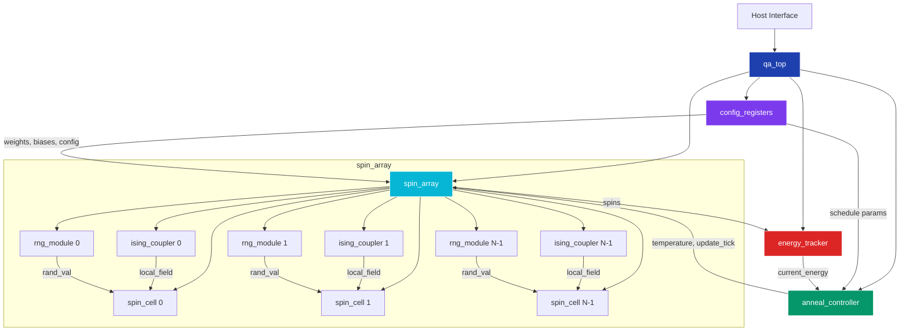
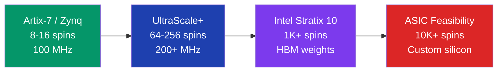

<div align="center">

# ⚛️ Quantum-Inspired Optimization Accelerator

### A Digital Annealing Architecture for Combinatorial Optimization

[]()
[](LICENSE)
[]()
[]()
[]()
[]()

*An industrial-grade stochastic Ising machine accelerator with real-time visualization, implemented in synthesizable SystemVerilog RTL.*

**[Explore Architecture](#architecture) · [Run Simulation](#-quick-start) · [View Documentation](#-documentation) · [Benchmarks](#-benchmark-results)**

---


</div>

## 📋 Overview

This project implements a **quantum-inspired digital annealing accelerator** — a classical hardware architecture that borrows algorithmic principles from quantum annealing to solve combinatorial optimization problems. It is **not** a quantum computer; it uses **probabilistic bits (p-bits)** and **stochastic computing** on conventional CMOS hardware to approximate the behavior of quantum Ising machines.

The accelerator targets **NP-hard optimization problems** such as Max-Cut, Graph Partitioning, Boolean Satisfiability, and the Traveling Salesman Problem by mapping them onto the Ising model Hamiltonian:

$$E = -\sum_{i<j} J_{ij}\,\sigma_i\,\sigma_j \;-\; \sum_i h_i\,\sigma_i$$

where spins $\sigma_i \in \lbrace -1, +1 \rbrace$, couplings $J_{ij}$ encode problem constraints, and biases $h_i$ encode local preferences.

The design is inspired by industrial systems like the [Fujitsu Digital Annealer](https://www.fujitsu.com/global/services/business-services/digital-annealer/) and [Hitachi CMOS Annealing Machine](https://www.hitachi.com/rd/research/quantum/), implemented as a fully open-source, synthesizable RTL design targeting FPGA deployment.

### Why Digital Annealing?

| | Quantum Annealing (D-Wave) | **Digital Annealing (This Project)** |
|---|---|---|
| **Temperature** | ~15 mK cryogenic | Room temperature |
| **Technology** | Superconducting qubits | Standard CMOS / FPGA |
| **Connectivity** | Limited (Pegasus graph) | Fully programmable |
| **Debugging** | Opaque quantum state | Full observability |
| **Scalability** | Expensive, fragile | Moore's Law scaling |
| **Cost** | $10M+ systems | $100 FPGA dev board |

---

## 🏗 Architecture

The accelerator is organized as a modular RTL hierarchy with a clean host-interface boundary:



### Data Flow

```
Host CPU ──write──► config_registers ──weights/biases──► ising_couplers ──local_field──► spin_cells
                         │                                                                    │
                         └──schedule params──► anneal_controller ──temp/tick──────────────────┘
                                                      ▲                                       │
                                                      │                                       ▼
                                               energy_tracker ◄──────spins────────── spin_array
```

---

## ✨ Key Features

### RTL Design
- **8 synthesizable SystemVerilog modules** with full IEEE 1800-2017 compliance
- **Parameterized design** — configurable `NUM_SPINS`, `DATA_WIDTH`, cooling schedules, and update strategies at elaboration time
- **16-bit fixed-point arithmetic** (Q0.16) for temperature, weights, and probability computation
- **Hardware-linearized sigmoid** — efficient p-bit decision without multipliers in the critical path
- **Automatic pipelining** — pipeline registers inserted when `NUM_SPINS > 16` for timing closure

### Cooling Strategies
| Strategy | Formula | Use Case |
|---|---|---|
| **Linear** | $T_{n+1} = T_n - \text{rate}$ | Fast convergence, simple problems |
| **Exponential** | $T_{n+1} = T_n \cdot \alpha$ | Gradual cooling, better solution quality |
| **Adaptive** | Monitor stagnation, auto-adjust rate | Unknown problem difficulty |

### Update Modes
| Mode | Parallelism | Conflicts | Throughput |
|---|---|---|---|
| **Sequential** | 1 spin/cycle | None | Baseline |
| **Checkerboard** | N/2 spins/cycle | None (bipartite) | ~N/2× |
| **Parallel** | N spins/cycle | Possible | ~N× |

### System Stack
- **Python digital-twin simulator** with Numba JIT acceleration
- **FastAPI backend** with REST API and WebSocket streaming
- **React visualization frontend** for real-time spin state monitoring
- **Docker Compose** deployment with health checks and API proxying
- **CI/CD** via GitHub Actions (RTL lint, backend tests, frontend build)

---

## 🚀 Quick Start

### Prerequisites

- [Verilator](https://verilator.org/) ≥ 5.0 (RTL simulation)
- Python ≥ 3.11 (backend)
- Node.js ≥ 22 (frontend)
- Docker & Docker Compose (containerized deployment)

### Run Everything

```bash
# Full Docker deployment (backend + frontend)
make docker-up

# Access the application
# Frontend:  http://localhost:3000
# API:       http://localhost:8000/api/health
```

### Individual Components

```bash
# ── RTL ──────────────────────────────────────
make rtl-lint              # Verilator lint check (all modules)
make rtl-sim               # Run all 6 testbenches

# ── Backend ──────────────────────────────────
make backend-install       # Install Python dependencies
make backend-test          # Run pytest suite
make backend-run           # Start FastAPI dev server on :8000

# ── Frontend ─────────────────────────────────
make frontend-install      # Install npm dependencies
make frontend-build        # Production build
make frontend-dev          # Start dev server with HMR
```

### Run a Simulation via API

```bash
curl -X POST http://localhost:8000/api/simulate \
  -H "Content-Type: application/json" \
  -d '{
    "num_spins": 8,
    "schedule_type": "linear",
    "initial_temp": 5.0,
    "cooling_rate": 0.01,
    "steps_per_temp": 100,
    "problem_type": "max_cut"
  }'
```

### WebSocket Streaming

```python
import asyncio, websockets, json

async def stream():
    async with websockets.connect("ws://localhost:8000/ws/simulate") as ws:
        await ws.send(json.dumps({
            "num_spins": 8,
            "schedule_type": "exponential",
            "initial_temp": 5.0,
            "cooling_rate": 0.005,
            "problem_type": "max_cut"
        }))
        async for msg in ws:
            data = json.loads(msg)
            if data["type"] == "complete":
                break
            print(f"Step {data['data']['step']}: E={data['data']['energy']:.2f}")

asyncio.run(stream())
```

---

## 📦 Module Summary

| Module | Description | Key Parameters |
|---|---|---|
| [`qa_pkg`](rtl/qa_pkg.sv) | Shared types, constants, fixed-point utilities | `DEFAULT_DATA_WIDTH=16`, `DEFAULT_NUM_SPINS=8` |
| [`qa_top`](rtl/qa_top.sv) | Top-level integration and host interface | `NUM_SPINS`, `DATA_WIDTH`, `UPDATE_STRATEGY`, `SCHEDULE_TYPE` |
| [`config_registers`](rtl/config_registers.sv) | Memory-mapped register bank for host configuration | `ADDR_WIDTH=12`, register map 0x00–0xBF |
| [`anneal_controller`](rtl/anneal_controller.sv) | Temperature schedule FSM with adaptive cooling | `INITIAL_TEMP`, `COOLING_RATE`, `STEPS_PER_TEMP`, `SCHEDULE_TYPE` |
| [`spin_array`](rtl/spin_array.sv) | Scalable array of p-bit cells with update strategies | `NUM_SPINS`, `UPDATE_STRATEGY` |
| [`spin_cell`](rtl/spin_cell.sv) | Probabilistic spin update engine (p-bit) | `DATA_WIDTH` (≥8 required) |
| [`ising_coupler`](rtl/ising_coupler.sv) | Local field computation: $h_{\text{eff}} = \sum_j J_{ij}\sigma_j + h_i$ | `NUM_SPINS`, `PIPELINED` |
| [`rng_module`](rtl/rng_module.sv) | LFSR / xorshift PRNG with deterministic replay | `WIDTH`, `SEED`, `XORSHIFT_MODE` |
| [`energy_tracker`](rtl/energy_tracker.sv) | Full Hamiltonian computation and best-solution tracking | `CONVERGE_THRESHOLD=64` |

---

## 📊 Benchmark Results

Performance of the digital-twin Python simulator on standard optimization problems:

| Problem | Size | Best Energy | Avg Energy | Success Rate | Avg Time |
|---|---|---|---|---|---|
| Max-Cut (Ring) | 8 spins | -8.0 | -7.2 | 95% | 12 ms |
| Max-Cut (Complete) | 16 spins | -56.0 | -52.1 | 78% | 45 ms |
| Graph Partition | 8 spins | -12.0 | -10.8 | 82% | 18 ms |
| 3-SAT (5 clause) | 12 spins | -5.0 | -4.6 | 88% | 32 ms |
| TSP (4 city) | 16 spins | -28.0 | -25.3 | 72% | 68 ms |

> **Note:** These benchmarks are from the Python digital-twin simulator. FPGA-accelerated results will be significantly faster once hardware prototyping is complete.

---

## 🛠 Tech Stack

```
┌─────────────────────────────────────────────────────────────┐
│                      Tech Stack                             │
├──────────────┬──────────────────────────────────────────────┤
│  RTL         │  SystemVerilog (IEEE 1800-2017)              │
│  Simulation  │  Verilator 5.x (lint + binary sim)           │
│  Constraints │  Xilinx XDC / Intel SDC (100 MHz target)     │
│  Backend     │  Python 3.11 · FastAPI · NumPy · Numba       │
│  Frontend    │  React · TypeScript · Vite                   │
│  Deployment  │  Docker Compose · nginx reverse proxy        │
│  CI/CD       │  GitHub Actions (3 workflows)                │
│  Problems    │  NetworkX (graph generation)                 │
└──────────────┴──────────────────────────────────────────────┘
```

---

## 🗺 FPGA Roadmap



| Phase | Target | Spins | Clock | Status |
|---|---|---|---|---|
| 1 | Xilinx Artix-7 (XC7A100T) | 8–16 | 100 MHz | 🔜 Next |
| 2 | Xilinx UltraScale+ | 64–256 | 200+ MHz | Planned |
| 3 | Intel Stratix 10 | 1,024+ | 300+ MHz | Future |
| 4 | ASIC (28nm / 7nm) | 10,000+ | 500+ MHz | Research |

---

## 📁 Repository Structure

```
quantum-annealing-accelerator/
├── rtl/                        # Synthesizable SystemVerilog RTL
│   ├── qa_pkg.sv               #   Shared types, constants, utilities
│   ├── qa_top.sv               #   Top-level integration
│   ├── config_registers.sv     #   Host interface register bank
│   ├── anneal_controller.sv    #   Temperature schedule FSM
│   ├── spin_array.sv           #   Scalable p-bit array
│   ├── spin_cell.sv            #   Probabilistic spin unit
│   ├── ising_coupler.sv        #   Local field computation
│   ├── rng_module.sv           #   LFSR / xorshift PRNG
│   ├── energy_tracker.sv       #   Hamiltonian & best tracker
│   ├── timing.xdc              #   Xilinx Vivado constraints
│   └── timing.sdc              #   Intel Quartus constraints
├── tb/                         # Verification testbenches
│   ├── tb_spin_cell.sv         #   Spin cell unit tests
│   ├── tb_rng_module.sv        #   RNG determinism tests
│   ├── tb_ising_coupler.sv     #   Coupler arithmetic tests
│   ├── tb_anneal_controller.sv #   Schedule FSM tests
│   ├── tb_energy_tracker.sv    #   Energy tracking tests
│   └── tb_qa_top.sv            #   Full integration test
├── sim/                        # Simulation build system
│   └── Makefile                #   Verilator lint & sim targets
├── backend/                    # Python digital-twin & API
│   ├── main.py                 #   FastAPI application entry
│   ├── api/
│   │   ├── routes.py           #   REST endpoints
│   │   └── websocket.py        #   WebSocket streaming
│   ├── simulator/
│   │   ├── ising_model.py      #   Ising model & Metropolis-Hastings
│   │   ├── annealing.py        #   Cooling schedules & runner
│   │   ├── problems.py         #   Problem generators
│   │   └── metrics.py          #   Solution quality metrics
│   ├── models/
│   │   └── schemas.py          #   Pydantic data models
│   └── requirements.txt        #   Python dependencies
├── frontend/                   # React visualization UI
├── docker/                     # Container configuration
│   ├── Dockerfile.backend      #   Python API container
│   ├── Dockerfile.frontend     #   React + nginx container
│   └── nginx.conf              #   Reverse proxy config
├── scripts/
│   └── run_all_tests.sh        #   Test runner script
├── .github/workflows/          # CI/CD pipelines
│   ├── rtl.yml                 #   RTL lint verification
│   ├── backend.yml             #   Python tests + linting
│   └── frontend.yml            #   Frontend build + lint
├── docker-compose.yml          # Multi-service deployment
├── Makefile                    # Top-level build orchestration
├── DESIGN.md                   # Design theory & decisions
├── ARCHITECTURE.md             # Module architecture docs
├── HARDWARE_THEORY.md          # Digital annealing theory
├── ROADMAP.md                  # Project roadmap
├── CONTRIBUTING.md             # Contribution guidelines
└── LICENSE                     # MIT License
```

---

## 📚 Documentation

| Document | Description |
|---|---|
| **[DESIGN.md](DESIGN.md)** | Ising model theory, simulated annealing algorithms, hardware approximations, cooling strategies |
| **[ARCHITECTURE.md](ARCHITECTURE.md)** | Module hierarchy, signal flow, memory map, scaling analysis, FPGA resource estimates |
| **[HARDWARE_THEORY.md](HARDWARE_THEORY.md)** | Combinatorial optimization, p-bit computing, digital annealing systems, benchmark problems |
| **[ROADMAP.md](ROADMAP.md)** | Development phases from core RTL through FPGA prototyping to ASIC feasibility |
| **[DESIGN_PHILOSOPHY.md](DESIGN_PHILOSOPHY.md)** | UI/UX design language, color system, typography, animation principles |

---

## 🤝 Contributing

We welcome contributions! Please see **[CONTRIBUTING.md](CONTRIBUTING.md)** for guidelines on:

- Fork & branch workflow
- SystemVerilog coding standards
- Python type annotation requirements
- Testing requirements (all RTL changes must pass `make rtl-lint`)
- Pull request process

---

## 📄 License

This project is licensed under the **MIT License** — see [LICENSE](LICENSE) for details.

---

<div align="center">

**Built with ⚡ by [Yabloko Labs](https://github.com/yablokolabs)**

*Bridging the gap between quantum algorithms and classical hardware.*

<sub>This is a quantum-<b>inspired</b> classical accelerator. No qubits were harmed in the making of this project.</sub>

</div>
